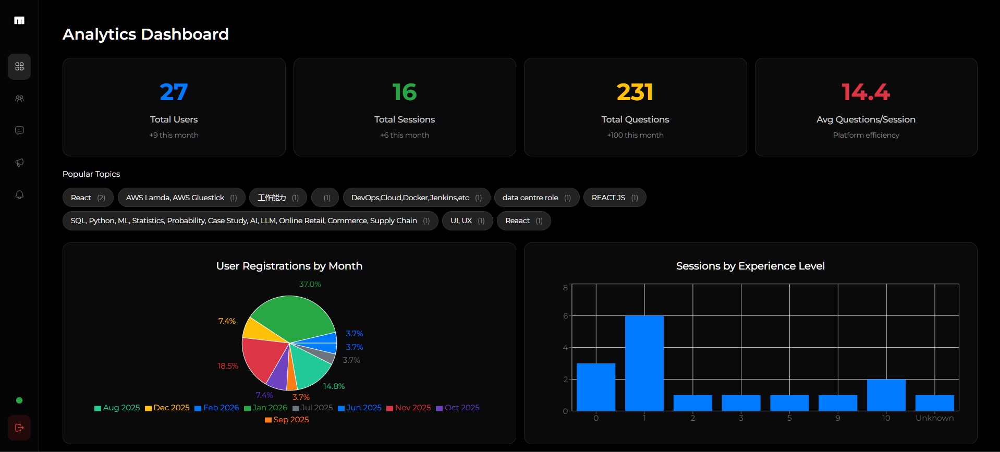
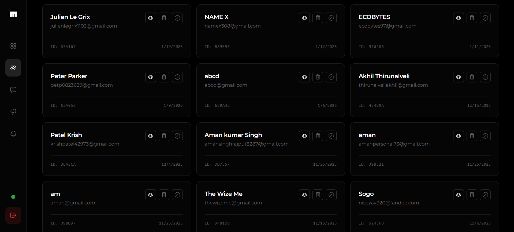
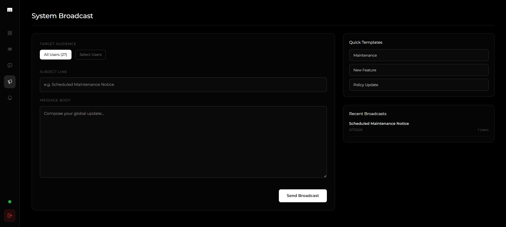

# 🤖 MockMate

<p align="center">
  
</p>

<p align="center">
  <strong>MockMate</strong> is a state-of-the-art, AI-driven interview preparation platform designed to bridge the gap between preparation and peak performance. Powered by <strong>Google Gemini 2.5 Flash</strong>, MockMate delivers personalized mock interviews, ATS-compliant resume auditing, a dedicated career companion (CoachMate), and WebRTC-based 1-on-1 live practice sessions.
</p>

<p align="center">
  <a href="#-key-features">Features</a> •
  <a href="#-tech-stack">Tech Stack</a> •
  <a href="#-system-architecture">Architecture</a> •
  <a href="#-getting-started">Getting Started</a> •
  <a href="#-deployment">Deployment</a> •
  <a href="#-project-structure">Structure</a>
</p>

---

## 🚀 Key Features & Showcases

### 1. Unified Dashboard
A central hub for tracking interview sessions, analyzing resume readiness, and managing preparation history.
<p align="center">
  
</p>

---

### 2. Session-Based Interview Prep & AI Question Generator
Create tailored interview prep sessions based on target job roles, years of experience, and custom topics. MockMate's backend prompts Google Gemini to generate high-quality, relevant technical question-and-answer pairs.
<p align="center">
  
  
</p>

---

### 3. Voice-Based HR & Technical Practice
Answer questions naturally by speaking. MockMate utilizes the browser's Web Speech API to capture speech in real time. Once submitted, Gemini analyzes the transcript and returns a rating (1-10), key takeaways, areas for improvement, and a refined response model.
<p align="center">
  
</p>

---

### 4. ATS Resume Checker & Bento Workspace
Upload your resume in PDF or DOCX format. MockMate extracts the text client-side and performs an ATS compatibility audit against your target job description—generating scores, highlighting missing keywords, and mapping improvements.
<p align="center">
  
  
</p>

---

### 5. CoachMate: Your AI Career Companion
A custom placement chatbot ready to help you research topics, refine answers, evaluate your resume, and navigate mock interview practices.
<p align="center">
  
</p>

---

### 6. Real-Time 1-on-1 Video Interview Mode (WebRTC)
Simulate realistic peer-to-peer interviews with real-time video, audio, and chat.
* **Socket.io** is used to coordinate WebRTC signaling (offers, answers, ICE candidates).
* **Simple-Peer** handles direct peer-to-peer media streams.
<p align="center">
  
  
</p>

---

### 7. Administrative Control Panel
Admins can monitor system metrics, broadcast global toast alerts, check user profiles, audit active prep sessions, and delete obsolete records with cascading cleanup.
<p align="center">
  
  <br/>
  
  
</p>

---

## 🛠️ Tech Stack

### Frontend
* **Core**: React 18 (SPA), Vite 6, Tailwind CSS 4, React Router v7.
* **Real-time & Media**: Socket.io Client, SimplePeer (WebRTC).
* **Analytics & Visuals**: Recharts (for resume scores/analytics), Framer Motion 12 (animations).
* **Libraries**: jsPDF & html2canvas (PDF generation), pdfjs-dist (PDF reader), mammoth (DOCX parser).
* **Auth**: Firebase Auth (Google OAuth integration).

### Backend
* **Runtime**: Node.js, Express 5.
* **Real-time**: Socket.io 4 (WebSockets signaling).
* **Database**: MongoDB & Mongoose 8.
* **AI Engine**: `@google/generative-ai` (Google Gemini 2.5 Flash API).
* **Security & Files**: JSON Web Tokens (JWT), bcryptjs, multer.

### Hosting & Services
* **Database**: MongoDB Atlas.
* **Storage**: Cloudinary (media & PDF storage).
* **Hosting**: Vercel (Frontend), Render/Railway (Backend).

---

## 📐 System Architecture

```
                    ┌─────────────────────────┐
                    │      React Client       │
                    └───────────┬─────────────┘
                                │
          ┌─────────────────────┼─────────────────────┐
          │ HTTP (REST APIs)    │ WebSockets          │ Google OAuth
          ▼                     ▼                     ▼
┌───────────────────┐ ┌───────────────────┐ ┌───────────────────┐
│    Express API    │ │  Socket.io Server │ │   Firebase Auth   │
└─────────┬─────────┘ └─────────┬─────────┘ └───────────────────┘
          │                     │
   ┌──────┴──────┐              ▼
   ▼             ▼       [WebRTC Peer-to-Peer]
┌──────┐  ┌──────────────┐
│Mongo │  │Google Gemini │
│  DB  │  │    AI API    │
└──────┘  └──────────────┘
```

---

## ⚙️ Getting Started

### Prerequisites
* **Node.js** (v18.0.0 or higher)
* **MongoDB** (Local instance or MongoDB Atlas URI)
* **Gemini API Key** (Get one from [Google AI Studio](https://aistudio.google.com/))

### 1. Clone & Set Up Backend
Navigate to the `backend/` folder:
```bash
cd backend
npm install
```

Create a `.env` file inside the `backend/` directory:
```env
PORT=5000
MONGO_URI=your_mongodb_connection_string
JWT_SECRET=your_jwt_secret_key
GEMINI_API_KEY=your_gemini_api_key
```

Start the backend:
```bash
# Development Mode (with nodemon)
npm run dev

# Production Mode
npm start
```

### 2. Set Up Frontend
Navigate to the `frontend/` folder:
```bash
cd ../frontend
npm install
```

Create a `.env` file inside the `frontend/` directory:
```env
VITE_BASE_URL=http://localhost:5000
VITE_API_URL=http://localhost:5000
VITE_ADMIN_CODE=1234
VITE_METERED_USERNAME=your_metered_username
VITE_METERED_CREDENTIAL=your_metered_credential

# Firebase Keys
VITE_FIREBASE_API_KEY=your_key
VITE_FIREBASE_AUTH_DOMAIN=your_domain
VITE_FIREBASE_PROJECT_ID=your_id
VITE_FIREBASE_STORAGE_BUCKET=your_bucket
VITE_FIREBASE_MESSAGING_SENDER_ID=your_sender_id
VITE_FIREBASE_APP_ID=your_app_id
```

Start the frontend:
```bash
npm run dev
```
Open `http://localhost:5174` in your browser.

---

## 📦 Deployment

Due to MockMate's use of persistent WebSockets (`Socket.io`) for 1-on-1 live video calls and chat routing, a serverless backend deployment (like Vercel Serverless Functions) will restrict live video rooms. 

We highly recommend deploying the **frontend on Vercel** and the **backend on Render or Railway**.

For detailed setup instructions, environment variable mapping, and Vercel configuration files, consult the complete deployment guide:
* 📄 [MockMate Deployment Guide](./deployment_guide.md)

---

## 📂 Project Structure

```
MockMate/
├── Assets/                        # Screenshots & GIF animations
├── backend/                       # Express backend code
│   ├── config/                    # MongoDB configuration
│   ├── controllers/               # Express request handlers & AI controllers
│   ├── models/                    # Mongoose database models
│   ├── routes/                    # API routing endpoints
│   ├── middlewares/               # Authentication and error middlewares
│   ├── server.js                  # Entry point (Server config & WebSockets)
│   └── package.json
└── frontend/                      # React client code
    ├── public/                    # Static assets
    ├── src/
    │   ├── assets/                # App UI icons/logos
    │   ├── config/                # Client configurations (Firebase)
    │   ├── constants/             # Endpoint paths
    │   ├── context/               # React State Management
    │   ├── hooks/                 # Custom Hooks (WebRTC integration)
    │   ├── utils/                 # Axios wrappers & document parsers
    │   └── pages/                 # UI Route Components
    ├── vite.config.js             # Build & Proxy configuration
    └── package.json
```
